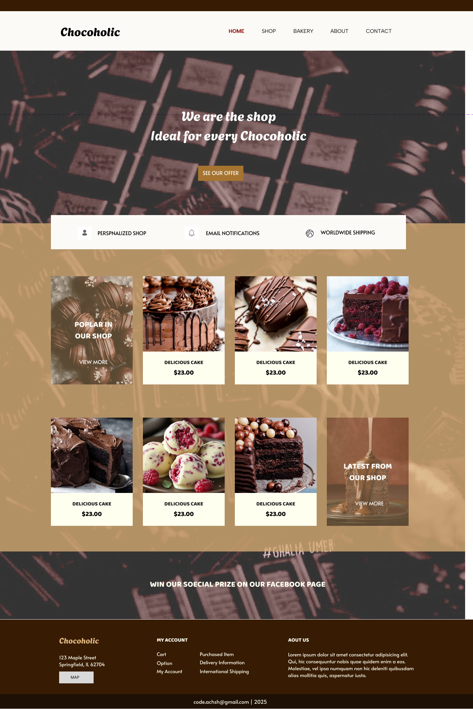

# Chocoholic-sample

I have tried to structure the portfolio differently than in the past. 
Common design elements used on multiple pages were grouped together in a common CSS file. 
By reusing common design elements, we were able to save time and unify the structure of the entire site. 
It is a matter of course, but the coding changed depending on the structure of each page other than the common design, so it was difficult to adjust the coding.

*If you like it, please send me a work order.
